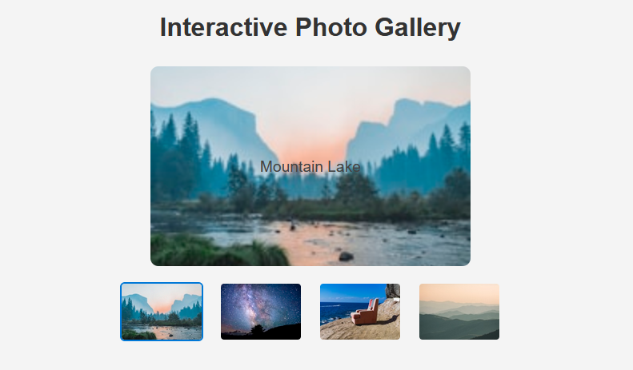

# Interactive Photo Gallery

An interactive photo gallery built with HTML, CSS, and JavaScript. Hover over any thumbnail image to display a larger preview and its description. This project is designed as a peer-graded assignment to practice DOM manipulation and event handling in JavaScript.

## Features

- **Live Preview:** Hovering over a thumbnail updates the main display area with a larger version and the image description.
- **Responsive Design:** Clean and modern layout using CSS Flexbox.
- **Beginner Friendly:** Simple code structure, ideal for learning DOM events and JavaScript basics.

- **Mobile Screenshot:**
  
  

## Live Demo

- **Live View:** [Open in Browser](https://ShahriarTbc.github.io/JavaScript_Interactive_Photo_Gallery)

## Getting Started

### 1. Clone the Repository

```sh
git clone https://github.com/ShahriarTbc/JavaScript_Interactive_Photo_Gallery.git
cd JavaScript_Interactive_Photo_Gallery
```

### 2. Open the Project

Open `Index.html` in your web browser to view and interact with the gallery.

## Project Structure

```
├── Index.html      # Main HTML file
├── styles.css      # CSS styles for layout and design
├── gallery.js      # JavaScript for interactivity
```

## How It Works

- **Hover Event:** When you hover over a thumbnail, the `upDate()` function updates the main display area with the image and its description.
- **Mouse Out Event:** When you move the mouse away, the `undo()` function resets the display area to its default state.

## Customization

- To use your own images, replace the `src` and `alt` attributes in the `` tags inside `Index.html`.
- Update styles in `styles.css` to match your preferred look and feel.

## License

This project is open source and available under the [MIT License](LICENSE).

## Author

[Shariar Ahamed](https://github.com/ShahriarTbc)

---

*This project was created as part of a JavaScript peer-graded assignment to practice DOM manipulation and event handling.*
